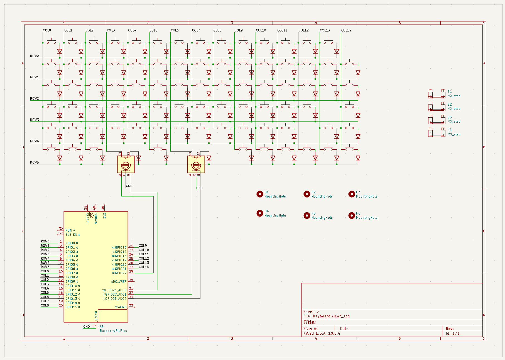

# Keyboard
A keyboard designed for Hackclub Keeb
# Devlog

First, I decided what I wanted on my keyboard. I went with a 65% layout with 2 rotary encoders. I then layed out the schematic.

I used Keyboard Layout Editor to make the layout for my keyboard and Keyboard Footprints Placer to place all of my switches and diodes. I then placed the stabilizers, knobs, and pico myself.

I routed the PCB, but had a lot of trouble with the placement of my pico. I wanted to keep the board as compact as possible, so I placed it on the underside of the board, which made routing way harder.

I then added a little bit of branding to the board with a nice silkscreen.